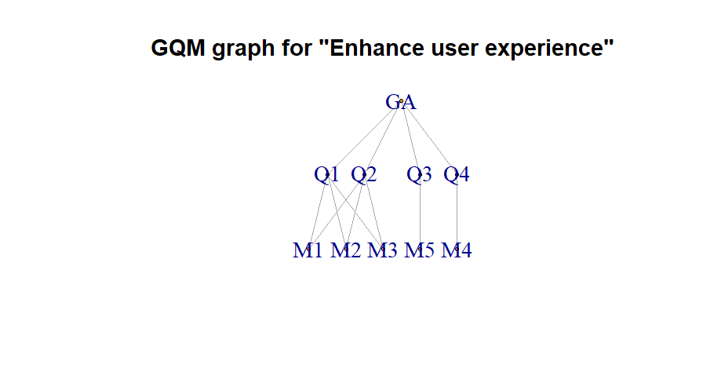

This document descibes concepts from each Lecture we have applied to the E-Library web app
==========================================================================================

Lecture 3
---------

**Concept:** Goal Based Metrics
**Pradigm Chosen:** Goal-Question-Metrics (GQM)

- Goal A: **(GA) Enhance user experience**
- Goal Questions
	1. (Q1) Which books do users prefer?
	2. (Q2) Are there specific genres or titles users wish we had more of?
	3. (Q3) Do users find the books in featured content relevant to their interests?
	4. (Q4) How do users rate the apps Loading speeds and responsiveness when browsing and reding books?
- Metrics for achieving the goals
	1. (M1) Book views
	2. (M2) Book ratings
	3. (M3) Session durations
	4. (M4) page load times
	5. (M5) like what you see numbers

- How we have implemeted the metrics
1. Book views
	- Each time a user opens a book, its view count is incremented in the database by 1  
		- **Attribute:** View count 
		- **Scale:** Ratio scale 
		- **Unit:** Count or views
	
Lecture 2
---------